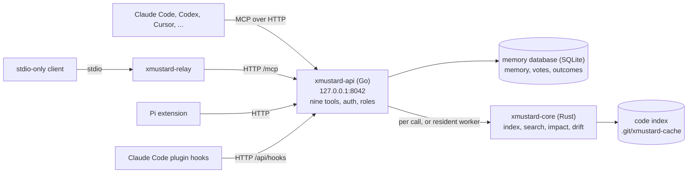

# xMustard

**Shared, verified memory for your coding agents, grounded in the repository they work on.**

[](https://github.com/just-very-queer/xMustard/releases/latest)
[](LICENSE)
[](https://github.com/just-very-queer/xMustard/actions/workflows/check.yml)

> Monday, Claude Code learns that `make test` needs `DB_URL` and remembers it, anchored to the
> `Makefile`. Tuesday, Codex recalls it before running the tests. Wednesday someone edits the
> `Makefile`, and the next `recall` flags the memory as stale.

This is Wednesday's `recall` from the v0.1.1 release, trimmed with `jq`. Step 3 of the
[Quickstart](#quickstart) reproduces it.

```json
{
  "content": "make test needs DB_URL set",
  "trust": "self_asserted_open_mode",
  "stale": true,
  "stale_paths": [
    "Makefile"
  ]
}
```

xMustard is a small MCP server that runs on your machine. The coding agents you already use
share one memory of the repository through it, and each memory says how it was checked: one
agent proposes a fact, other agents approve it, and `recall` checks it again against the files
it cites. Claude Code, Codex, Cursor and other MCP clients connect over MCP, and
[Pi](https://github.com/earendil-works/pi), an MIT-licensed coding agent CLI, gets its own
extension.

The same server answers the code questions agents ask all day: what changed, where is it, what
does this file do, what breaks if I touch it, why did that fail. Memory and code tools read the
same repository, so `ground` reports stale memory next to changed files and signatures. It runs
as one API on `127.0.0.1`, a Rust core and SQLite. No Docker. MIT licensed.

**v0.1.1 is out.** It adds a Claude Code plugin with hooks, an index watcher, a background
service with store backup and file-level `impact`, and fixes evidence capture and drift checks.
Prebuilt binaries for macOS arm64 and Linux x86_64 are on the
[release page](https://github.com/just-very-queer/xMustard/releases/tag/v0.1.1). Read the
[release notes](docs/releases/v0.1.1.md).

## Why xMustard

- **Memory that says how it was checked.** Give each agent a token, and a memory is shared only
  after other agents approve it: by default, two approvals from agents other than its author.
  Every recalled entry carries a [trust label](#one-agent-two-or-a-team).
- **Memory that notices drift.** Anchor a fact to the files it is about. xMustard hashes them
  when the fact is promoted, and `recall` flags it stale when one of them changes, appears or
  disappears.
- **Orientation in one call.** `ground` reports what changed, went stale, broke or got blocked
  since the baseline (the state recorded when you registered the repository), including
  contract breaks: changed parameters or return types. Its output fits a budget (6,000
  characters by default), and failure and stale signals survive as counts or flags.
- **Search that reads function bodies.** Hybrid ranking fuses BM25 over bodies, comments, names,
  paths and docs with identifier and typo-tolerant matching. Hits come back as `path:line` with
  snippets and the reasons they ranked. 15 tree-sitter grammars cover Go, Rust, TypeScript, TSX,
  JavaScript, Python, Java, C, C++, C#, Ruby, PHP, Kotlin, Swift and Bash.
- **Light enough to leave running.** Two agents on the relay peaked at 60.8 MiB for the whole
  process tree on the v0.1.1 release tree (Linux x86_64), with the resident worker off. The
  relay itself uses about 2 MiB per agent on macOS arm64 and up to 3 MiB on Linux.
- **Failures explained and remembered.** `why_failed` reads a run, a pasted log or an evidence
  handle, points at the error lines, and records the failure so the next `ground` lists it.
- **Hooks that shrink what the agent reads.** In Claude Code, the plugin replaces a large Bash,
  Read or Grep output with a reduction that names a recovery handle, redacted before anything
  is kept, and adds memory a human approved before the agent reads or edits a file.

## How it compares

- **Instruction files** (`AGENTS.md`, `CLAUDE.md`) are loaded as written, and nothing flags a
  line when the code it describes changes. xMustard does not replace them; it holds the facts
  agents learn while they work.
- **Memory servers** such as Mem0 and Zep/Graphiti store and search agent memory and keep its
  history or provenance. xMustard keeps memory per repository: an entry can be anchored to the
  repository's files, and `recall` checks it against them.
- **Code-intelligence servers** such as Serena, GitNexus and Sourcegraph offer symbol-level code
  navigation over MCP; Serena works through language servers or a JetBrains backend, and
  GitNexus adds impact analysis. xMustard's code tools do not edit code. They exist so that
  memory and `ground` rest on the current code.

A [review of seven memory and code-context tools](docs/research/COMPETITOR_PARITY_2026-09-24.md)
on 2026-09-24 found none whose documentation described both approval by distinct agents before
a memory is shared and a check of the memory's repository files on recall. The review read
documentation and source only; no tool was installed or benchmarked.

## Quickstart

You need macOS on Apple silicon, or Linux x86_64 with glibc 2.35+ (Ubuntu 22.04+, Debian 12+).
Elsewhere, you can try [building from source](#build-from-source). You also need `git` and
`jq`. Run all four steps in one shell.

**1. Install the binaries.**

```bash
V=v0.1.1
A=xmustard-$V-darwin-arm64            # Linux: A=xmustard-$V-linux-x86_64
curl -fsSLO https://github.com/just-very-queer/xMustard/releases/download/$V/$A.tar.gz
curl -fsSLO https://github.com/just-very-queer/xMustard/releases/download/$V/$A.tar.gz.sha256
shasum -a 256 -c $A.tar.gz.sha256     # Linux: sha256sum -c $A.tar.gz.sha256
tar xzf $A.tar.gz
mkdir -p ~/.local/bin && cp $A/xmustard-* ~/.local/bin/
export PATH="$HOME/.local/bin:$PATH"  # add this line to your shell profile as well
```

The archive holds all five binaries: `xmustard-api`, `xmustard-ops`, `xmustard-relay`,
`xmustard-core` and `xmustard-mcp`. The macOS ones are ad-hoc signed, not notarized: `curl`
downloads run as they are, but after a browser download run
`xattr -d com.apple.quarantine ~/.local/bin/xmustard-*`.

**2. Start the API.**

```bash
export XMUSTARD_DATA_DIR="$HOME/.xmustard"          # add this line to your shell profile as well
mkdir -p "$XMUSTARD_DATA_DIR"
xmustard-api > "$XMUSTARD_DATA_DIR/api.log" 2>&1 &  # runs in the background on 127.0.0.1:8042
curl -fs --retry 5 --retry-connrefused http://127.0.0.1:8042/api/health > /dev/null && echo "API is up"
```

Set `XMUSTARD_DATA_DIR` wherever you run `xmustard-api` or `xmustard-ops`. Its default,
`../backend/data`, is relative to the current directory, so a shell without it reads and writes
a different store. The service commands (`setup`, `daemon`, `store`, `uninstall`) take it only
when it is absolute; otherwise they use the platform's data directory
(`~/Library/Application Support/xmustard` on macOS, `$XDG_DATA_HOME/xmustard` or
`~/.local/share/xmustard` on Linux). With no tokens minted, the API runs in open mode: every
caller shares one identity, and a memory is promoted at once as `self_asserted_open_mode`.

**3. Watch a memory go stale.** This uses a throwaway repository, so your own files stay
untouched.

```bash
cd "$(mktemp -d)" && git init -q
printf 'test:\n\tgo test ./...\n' > Makefile
WS=$(xmustard-ops workspace load --root-path "$PWD" | jq -r .workspace.workspace_id)

# xm <tool> '<json arguments>': one MCP tool call through the stdio relay
xm() { printf '%s\n' \
  '{"jsonrpc":"2.0","id":0,"method":"initialize","params":{"protocolVersion":"2025-06-18","capabilities":{},"clientInfo":{"name":"sh","version":"0"}}}' \
  "{\"jsonrpc\":\"2.0\",\"id\":1,\"method\":\"tools/call\",\"params\":{\"name\":\"$1\",\"arguments\":$2}}" |
  xmustard-relay --workspace "$WS" | jq 'select(.id==1) | .result.structuredContent // .result.content[0].text // .error'; }

xm remember '{"content":"make test needs DB_URL set","paths":"Makefile"}' | jq -c '{status, verification_mode}'
printf 'lint:\n\tgo vet ./...\n' >> Makefile       # someone edits the Makefile
xm recall '{"q":"make test"}' | jq '.entries[0] | {content, trust, stale, stale_paths}'
xm ground '{}' | jq -r .summary
```

`remember` promotes the memory at once
(`{"status":"verified","verification_mode":"self_asserted_open_mode"}`), `recall` prints the
stale entry shown [at the top of this page](#xmustard), and `ground` counts it:

```text
1 changed file(s), 0 dirty symbol(s), 0 contract break(s), 0 failed run(s), 1 stale memory. 1 memory self-asserted in open mode (not peer-verified).
```

**4. Connect your repository to Claude Code.**

```bash
cd /path/to/your/repo
WS=$(xmustard-ops workspace load --root-path "$PWD" | jq -r .workspace.workspace_id)   # register it and record its baseline
claude mcp add --transport http xmustard "http://127.0.0.1:8042/mcp?workspace=$WS&client=claude-code"
claude mcp list                          # the xmustard line ends in "Connected"
```

Ask Claude to run `ground` at the start of a task and `recall` before it edits. From this shell,
`xm ground '{}'` makes the same call.

## The nine tools

Eight of them work with nothing beyond the Quickstart. `diagnostics` needs a Postgres database in
v0.1.1.

| Tool | What it answers | Example |
|---|---|---|
| `ground` | What changed, went stale, broke or got blocked since the baseline? Includes index drift and contract breaks. | no arguments |
| `recall` | What do we already know about this task or these files? Ranked by BM25, path overlap, trust, recency and feedback. | `q="make test"` `paths="Makefile"` |
| `remember` | Propose a fact, decision or gotcha, anchored to the files it is about. | `content="make test needs DB_URL set"` `paths="Makefile"` |
| `verify` | Approve or reject another agent's proposed memory. | `entry_id="ctx_..."` `approve=true` |
| `search` | Where is it? `path:line` hits with snippets and reasons. `mode=pattern` runs an ast-grep query (needs `ast-grep` on `PATH`). | `q="session expiry"` |
| `explain` | What is this file for, what are its key symbols, and how do I run or verify it? Files only in v0.1.1; a directory returns an error. | `path="src/server.ts"` |
| `impact` | What might break if I change this? A lexical reference graph up to 4 hops, from the current changes, a symbol, or one file (`path=`), so treat edges as leads, not proof. | `symbol="parseConfig"` or `path="src/config.ts"` |
| `diagnostics` | Which errors and warnings does the workspace have now? Needs Postgres in v0.1.1. | no arguments |
| `why_failed` | Why did this fail? Error lines and implicated files from a run, a pasted log or an evidence handle. | `log="<test output>"` |

`workspace_id` is optional everywhere. It resolves from the connection's binding,
`XMUSTARD_WORKSPACE_ID`, the client's roots or the working directory. `mode=readonly` hides
`remember` and `verify`. In the default lean schema, advanced arguments stay out of
`tools/list`, which keeps the list of all nine tools under 9 KB. They are documented in the MCP
resource `xmustard://docs/tools`.

Arguments are checked, never silently coerced. A wrong argument comes back as a tool error the
agent can read (`isError`): what was wrong, a hint when the agent likely meant another tool or
argument, and the tool's arguments. An unknown tool or malformed `tools/call` parameters are a
JSON-RPC `-32602`.

## Connect your agent

The API serves MCP over Streamable HTTP at `http://127.0.0.1:8042/mcp`. A client that takes a URL
needs no extra process. A client that can only launch a command uses `xmustard-relay`, a small
stdio bridge. `xmustard-ops mcp-config --root "$PWD" [--transport http|relay] [--client NAME]
[--mode readonly]` prints a ready `mcpServers` entry for either. The entry refers to
`${XMUSTARD_API_TOKEN}` and never contains the token itself. The workspace id comes from the
checkout's absolute path, so generate an entry per checkout. The examples below use `$WS` from
step 4 of the Quickstart.

| Client | What v0.1.1 ships |
|---|---|
| Claude Code | MCP over HTTP or the relay, and a plugin with hooks (from a source checkout) |
| Codex | MCP configuration only; no Codex hook package yet |
| Pi | An in-repo extension that calls the API directly |
| Cursor, OpenCode, other MCP clients | The generic `mcp-config` entry; no OpenCode plugin yet |

<details>
<summary><b>Claude Code: with a token, through the relay, or as a project file</b></summary>

Pick one.

```bash
# HTTP, no extra process. Add the header once tokens are minted.
claude mcp add --transport http xmustard "http://127.0.0.1:8042/mcp?workspace=$WS&client=claude-code" \
  -H 'Authorization: Bearer ${XMUSTARD_API_TOKEN}'
# stdio, through the relay (xmustard-relay must be on the PATH Claude Code starts with)
claude mcp add xmustard -e 'XMUSTARD_API_TOKEN=${XMUSTARD_API_TOKEN}' -- xmustard-relay --workspace "$WS" --client claude-code
# project scope: Claude asks you to approve it on the next run, and warns if XMUSTARD_API_TOKEN is unset
xmustard-ops mcp-config --root "$PWD" --client claude-code > .mcp.json
```

</details>

<details>
<summary><b>Claude Code plugin: hooks that reduce output and push approved memory</b></summary>

The plugin in [`integrations/claude-code`](integrations/claude-code/README.md) adds the nine
tools and posts Claude Code's hook events to the API. `PostToolUse` replaces a large native
output (Bash, Read, Grep, Glob, WebFetch, other MCP servers) with its reduction, redacted and
kept behind a recovery handle. Before a search or a file read it adds matching index hits and
memory a human approved; at session start, ground's summary. No hook allows, denies or rewrites a tool
call, and a slow answer (past about 200 ms) leaves Claude Code's own output. From a source
checkout, with Go 1.26:

```bash
# 1. build the static hook client into the plugin (it is not in the release archive)
(cd api-go && go build -o ../integrations/claude-code/hooks/bin/xmustard-hook ./cmd/xmustard-hook)
# 2. run the API with the resident worker, which serves index hits and syntax errors to hooks
XMUSTARD_CORE_WORKER=1 xmustard-api      # or: xmustard-ops setup --env XMUSTARD_CORE_WORKER=1
# 3. once tokens are minted, give Claude Code an agent token
export XMUSTARD_API_TOKEN=<token>        # from: xmustard-api mint-token claude-1 agent
# 4. load the plugin
claude --plugin-dir integrations/claude-code
```

Register the repository first (`workspace load`, step 4 of the Quickstart). The hook URLs name
`127.0.0.1:8042`; edit `hooks/hooks.json` if the API listens elsewhere. A hook pushes only
memory that a human approver approved, that is not quarantined and that scans clean.

</details>

<details>
<summary><b>Codex</b></summary>

```bash
# Codex stores the variable's name in config.toml, not the token. Leave the flag out in open mode.
codex mcp add xmustard --url "http://127.0.0.1:8042/mcp?workspace=$WS&client=codex" \
  --bearer-token-env-var XMUSTARD_API_TOKEN
```

Or write the entry yourself: `xmustard-ops mcp-config --root "$PWD" --client codex` prints it as
a table for `~/.codex/config.toml`. Codex sends no MCP roots, so the workspace header binds the
project:

```toml
[mcp_servers.xmustard]
url = "http://127.0.0.1:8042/mcp?client=codex&workspace=<id>"
bearer_token_env_var = "XMUSTARD_API_TOKEN"
http_headers = { "X-Xmustard-Workspace" = "<id>" }
```

</details>

<details>
<summary><b>Pi</b></summary>

Pi gets an in-repo extension instead of MCP: the nine tools as direct HTTP calls, plus
`xmustard_expand` to page back full outputs. From a source checkout, with Node 22.19+:

```bash
cd integrations/pi && npm ci --ignore-scripts
XMUSTARD_API_BASE=http://127.0.0.1:8042 XMUSTARD_TOKEN=<token> ./node_modules/.bin/pi -e ./src/index.ts
```

Pi reads `XMUSTARD_TOKEN`, not `XMUSTARD_API_TOKEN`, and needs it only once auth is on. It never
registers a repository, so run `workspace load` first. Its built-in tool reduction, masking and
compaction go through the API's redacting capture. See [integrations/pi](integrations/pi/README.md).

</details>

<details>
<summary><b>Cursor, OpenCode and other MCP clients</b></summary>

Put the `mcp-config` output (`--client cursor` or `--client opencode`; add `--transport relay`
for a command-only client) into the client's MCP config, in its format and token syntax.
`--client` only labels usage.

</details>

## Run it as a service

`xmustard-ops setup` installs the API as a per-user service and waits until it answers
`/api/health`: a launchd agent on macOS, started at login and restarted after a crash, or a
systemd socket and service on Linux, where the first connection starts the daemon and
connections made while it restarts wait instead of being refused. Rerun setup after an upgrade
to restart the daemon on the new binaries; it migrates and checks the memory database as it
starts. The unit binds loopback only, never carries a token, and logs to a size-capped, rotated
file.

Stop the Quickstart's `xmustard-api` first (`kill %1` in the shell that started it): setup
refuses a port that another API already answers on. With `XMUSTARD_DATA_DIR` set to an absolute
path, as in the Quickstart, the service uses the same store.

```bash
xmustard-ops setup [--root "$PWD" --client claude-code]  # --root also prints the MCP entry
xmustard-ops daemon status|restart|stop
xmustard-ops store backup                 # a verified copy, safe while the daemon runs
xmustard-ops store check [--file PATH]    # identity, schema and quick_check, read-only
xmustard-ops store restore <backup>       # stops the daemon, swaps the store, starts it
xmustard-ops uninstall                    # keeps the data dir and the logs
```

On Linux, `loginctl enable-linger` keeps the daemon running without a login session. Through
the relay, calls wait up to 10 s for a restarting daemon.

## One agent, two, or a team

Every recalled memory carries one of three trust labels:

- `peer_verified`: approved by enough agents other than its author.
- `single_agent`: promoted on one authenticated agent's word, because the operator set
  `"require_multi_agent_verification": false` in `<data dir>/settings.json`.
- `self_asserted_open_mode`: written in open mode, where no tokens exist and every caller shares
  one identity.

Pick the setup that matches how many agents you run:

- **One agent.** Stay in open mode. You get `ground`, `search`, `explain`, `impact`,
  `why_failed`, and memory that persists across sessions with drift checks. Every memory is
  labelled `self_asserted_open_mode`.
- **Two agents**, say Claude Code and Codex. Mint a token for each, and set
  `"context_verification_threshold": 1` in `<data dir>/settings.json` before they start
  proposing (no restart needed). A memory one agent proposes becomes `peer_verified` when the
  other approves it with `verify`.
- **Three or more agents.** Mint a token for each and keep the default: two approvals from
  agents other than the author.

```bash
xmustard-api mint-token alice agent    # prints a token (xmt_...); mint one per agent
xmustard-api mint-token bob agent
xmustard-api mint-token carol agent
```

Run these with the API's `XMUSTARD_DATA_DIR`. The running API picks the tokens up without a
restart, and from then on every call must authenticate: give each agent its own token through
`XMUSTARD_API_TOKEN` and add the header shown under [Connect your agent](#connect-your-agent).
When `alice` proposes a memory, it becomes `peer_verified` after `bob` and `carol` approve it.
The roles are `admin`, `human-approver`, `indexer`, `verifier`, `proposer` and `reader`; `agent`
means proposer plus verifier.

## Known limits in v0.1.1

- **`diagnostics` needs Postgres.** Without `postgres_dsn` in `<data dir>/settings.json` it
  returns "Postgres DSN is required to read diagnostics". The `XMUSTARD_PG_DSN` environment
  variable does not supply it.
- **`explain` takes files only.** A directory path returns an error, although the tool
  description mentions directories.
- **`search` in pattern mode needs `ast-grep` on `PATH`.** Without it, a `mode=pattern` search
  answers engine `"none"` with no matches and no error, which looks like a pattern that matches
  nothing.
- **`impact` is lexical.** Its edges come from symbol names and import lines, so treat them as
  leads, and a name shorter than 4 characters makes no edge.
- **The Claude Code plugin needs a source checkout.** Its static hook client is not in the
  release archive, so building it needs Go. Index hits and syntax reports in hooks, and the
  file watcher, need the opt-in resident worker (`XMUSTARD_CORE_WORKER=1`). A hook client that
  gives up in the last ~20 ms of its budget on a loaded host drops an answer the API counted as
  delivered, so those memories are not pushed again until compaction. Codex, Cursor and
  OpenCode get MCP configuration only; their hook adapters are planned. The Pi extension's
  end-to-end suite passes 9 of its 18 tests; the other nine need a multi-page `impact` result
  that its fixture no longer produces.
- **Redaction is pattern-based.** Captured output is redacted before it is kept, but a secret
  no rule recognizes is kept as written. A secret file read through a shell (`cat .env`) or
  matched by a directory search is checked by content only, and a secret split across two
  output strings of one hook body is not joined. Revoke an original with
  `DELETE .../evidence/{handle}`.
- **Platforms.** Prebuilt archives cover macOS arm64 and Linux x86_64. The Linux archive is
  built on Ubuntu 22.04, so it needs glibc 2.35 at most; the exact floor was not measured.
  Neither CI nor the release covers any other system, so elsewhere a source build is the only
  option, and it is untested. There is no public Homebrew tap yet.
- **The service.** On macOS the launchd agent has no socket activation, so connections are
  refused while it restarts. A hung daemon is not detected (no watchdog). `store restore` stops
  the daemon while it swaps the store. Under systemd, `daemon status` starts the daemon.
- **Heavier workloads.** A larger benchmark suite (4 agents, 2 repositories, 4 worktrees) has
  not passed its 95.4 MiB line yet. The resident worker costs memory: with it on, gate v2's
  2-agent parity scenario peaked at 201–209 MiB, the worker alone at 171–185 MiB. The 60.8 MiB
  above is a lighter scenario with the worker off. After 2 idle minutes the worker exits, and
  nothing is watched until the next call.
- **The first `ground` while xMustard is busy** can report no baseline, because the memory
  governor refused to build it; a later `ground` builds it.
- **Upgrading from v0.1.0.** The memory database moves to a new schema that v0.1.0 cannot
  open, so run `xmustard-ops store backup` before any other v0.1.1 command if you may go back;
  for a store at v0.1.0's relative default, pass `--data-dir`. Memories promoted under v0.1.0
  and anchored at an even path depth, such as `pkg/auth.go`, recorded that file as missing, so
  `recall` now flags them stale; check them and supersede or retire them. The
  [release notes](docs/releases/v0.1.1.md#upgrading) have the steps.

The full list is in the [release notes](docs/releases/v0.1.1.md#known-limits) and on the
[status page](docs/STATUS.md#known-limits-in-v011).

## How it works



The Go API (`api-go`) owns MCP, auth, roles and the memory database, a SQLite file in your data
directory. The Rust core (`rust-core`) owns the tree-sitter index, hybrid search, impact and
change tracking. The API starts it per call; `XMUSTARD_CORE_WORKER=1` keeps a resident worker
(opt-in) that also watches the repository and refreshes the index as files change.
[Architecture](docs/ARCHITECTURE.md) has the full picture.

## By the numbers

Measured, with the conditions that matter. Each source has the details, and
[status](docs/STATUS.md#measured) lists more.

| Result | What was measured | Conditions |
|---|---|---|
| 60.8 MiB | Peak RSS of the whole process tree with 2 agents on the relay (budget gate line: 95.4 MiB) | v0.1.1 release tree, Linux x86_64, 6 cores, resident worker off ([release notes](docs/releases/v0.1.1.md#measured-on-the-release-tree-linux-x86_64-build-box)) |
| 2.1–2.2 MiB vs 13.5 MiB | RSS per stdio agent: relay vs the older Go `xmustard-mcp` shim | macOS arm64, 3 runs ([relay RSS](docs/benchmarks/2026-09-26-ws13-relay-rss.md)) |
| 25.0 MiB | Peak RSS to index all 2,660 files (51,263 symbols) of the cline repo with no file cap, segment write included | Apple M1 ([index RSS](docs/benchmarks/2026-09-25-ws07-index-rss.md), [resident index](docs/benchmarks/2026-09-26-ws14-resident-index.md)) |
| 28.5 ms / 31.0 ms | `recall` p50 / p95 over 1,000 memories, through the API | Linux, 6 cores ([status](docs/STATUS.md#measured)) |
| 424 ms / 488 ms | p50 from a file edit to the index that holds it, with the watcher | 5,000-file tree, in-process loop; Linux (inotify) / Apple M1 (FSEvents) ([watcher](docs/benchmarks/2026-09-28-ws15-watcher.md)) |
| 4.2 ms / 7.5 ms | p50 / p95 of a Claude Code `PreToolUse` hook on a file read, answered by the running API | Linux, 6 cores, 600 calls from 4 concurrent clients ([release notes](docs/releases/v0.1.1.md#claude-code-plugin-and-hook-service-ws-23)) |
| 19,544 B → 4,550 B | `ground` output with the default budget, all 200 contract breaks still counted | pi-mono clone, 1,929 files, 60 files with a changed signature ([status](docs/STATUS.md#measured)) |

**Not measured yet:** token savings or task success on real agent tasks. The evaluation harness
(`xmustard-eval`) exists, but the repository records no real-model run yet. None of these numbers
compares xMustard with another tool.

## Safe by default

- **Local first.** The API binds `127.0.0.1:8042`. A non-loopback bind is refused unless auth
  is required, tokens exist and TLS is configured (or delegated to a TLS proxy).
- **Least privilege.** Tokens carry roles, roles gate every route, and `tools/list` shows each
  caller only its tools. `why_failed` runs no commands unless you set
  `XMUSTARD_WHY_FAILED_COMMANDS=1` and call it with an admin token; command mode is host-code
  execution, not a sandbox.
- **Secrets stay out.** Memory is redacted on ingest, and captured tool output before a byte is
  kept. Search and capture refuse secret paths such as `.env`, and snippets mask
  credential-shaped words. Capture fails closed without a working redactor. By default, the
  relay sends the token only to loopback hosts.
- **Hooks never decide.** A hook adds context or a reduced output, or says nothing; it never
  allows, denies or rewrites a tool call, and the API starts no process for one.
- **Memory is data, not instructions.** Recalled memory carries `injection_flags` from an
  instruction-pattern scan (a pattern check, not a classifier), and content from untrusted
  captures is quarantined.

The full model is in [docs/SECURITY.md](docs/SECURITY.md).

## Roadmap

- **Shipped in v0.1.1:** the streaming secret redactor (evidence capture, and with it Pi's
  built-in tool reduction, masking and compaction), a Claude Code plugin with hooks, a file
  watcher that keeps the resident index fresh, a background service (launchd or systemd) with
  store backup and restore, file-level `impact`, and a tag-triggered release workflow.
- **Next:** Codex hooks, an OpenCode plugin and Cursor hooks; the hook client in the release
  archive; a Homebrew formula on the prebuilt Linux archive.
- **Later:** a static-embedding search lane, impact analysis with risk tiers, symbol resolvers
  for Rust, Python and Java, session handoff between clients, and an evaluation suite for memory
  and context reduction.

What is under way now is in [status](docs/STATUS.md#in-progress). The roadmap's working plan, by
workstream: [build plan](docs/plans/2026-09-25-parity-build-plan.md).

## Build from source

With Go 1.26 and stable Rust (the release workflow pins 1.93.1), `make build` builds all five
binaries. `make install` copies them into `$PREFIX/bin`; the default `PREFIX=/usr/local` usually
needs `sudo`, and `make install PREFIX=$HOME/.local` does not. `make release VERSION=v0.1.1`
builds the release archive for your platform. The Homebrew formula in
[`packaging/homebrew/xmustard.rb`](packaging/homebrew/xmustard.rb) installs the v0.1.0 archive on
macOS arm64 and builds the v0.1.0 tag from source elsewhere until it is moved to v0.1.1
(`packaging/homebrew/bump.sh`); Homebrew installs formulae only from a tap, so copy it into a
local one (`brew tap-new`) until a public tap exists.

## Learn more

- [Documentation map](docs/README.md), [vision](docs/VISION.md), [architecture](docs/ARCHITECTURE.md) and [status](docs/STATUS.md)
- [Security model](docs/SECURITY.md), [v0.1.1 release notes](docs/releases/v0.1.1.md) and [v0.1.0 release notes](docs/releases/v0.1.0.md)
- [Benchmarks and gates](scripts/bench/README.md) and the [measurement records](docs/benchmarks/)
- [Claude Code plugin](integrations/claude-code/README.md) and [Pi extension](integrations/pi/README.md)

**Contributing.** Start with [AGENTS.md](AGENTS.md). Run `make check-backend` (Go tests and build,
Rust tests and Clippy) before you open a pull request.

**License.** [MIT](LICENSE), except files whose header names another licence: the
finding-anchoring files in `api-go/internal/anchor/` are Apache-2.0 translations of
[open-code-review](https://github.com/alibaba/open-code-review), linked only into builds with
the `review` build tag. See [NOTICE](NOTICE).
