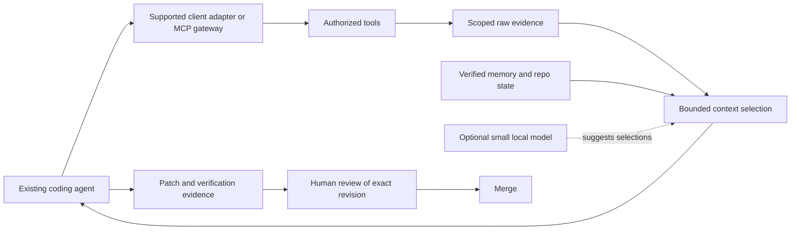

# Context layer for existing coding agents

Design updated 2026-09-24 after the owner's scope clarification. A bounded
implementation candidate now covers xMustard's own MCP delivery and one pinned
Pi extension; the reviewed source is now imported into the main working tree and
remains uncommitted. Its implementation gates pass; the exact diff still awaits
human review and merge. This is not general gateway/interception behavior. See [status](STATUS.md)
and the [Go](reviews/2026-09-24-implementation-results.md),
[Rust](reviews/2026-09-24-rust-implementation-results.md), and
[Pi](reviews/2026-09-24-pi-implementation-results.md) reports. Remaining design
stages and external claims are distinguished below and in the dated
[research](research/TOOL_CONTEXT_RESEARCH_2026-09-24.md).

## Product behavior

xMustard should help several agents work in one repo, carry context between
clients/sessions, and share approved knowledge across selected repositories. It
should also reduce the evidence those agents repeatedly consume, while keeping
the original accessible and its trust/freshness visible. The outer agent continues
to plan, use its authorized tools, and produce the patch.

Shared operation needs one coordinated persistence authority. Existing in-process
store locks do not serialize unrelated CLI/API processes writing the same files;
adding more client adapters must not multiply independent writers to that store.

The longer-term proposed flow is:

This describes application integration, not transparent access to every agent's
traffic. Only explicitly connected tool paths are covered.

## Three different opportunities

| Opportunity | Intended behavior | First implementation rule |
| --- | --- | --- |
| Tool discovery | Present only the useful tool descriptions, then obtain the full schema before invocation | Preserve canonical names, argument contracts, permissions, and collision handling; discovery is not authorization |
| Result reduction | Keep relevant source ranges, failure details, counts and identifiers; collapse repetition and verbose presentation | Start with deterministic, source-linked projections and explicit omission metadata |
| Session continuity | Recall supported decisions and prior outcomes without repeatedly replaying full logs | Distinguish raw observations, derived summaries, and verified shared memory |

Shortening JSON whitespace is not evidence of large token savings. Truncation is
not lossless compression. A projection can omit information from the immediate
prompt only if it declares that omission and offers an authorized recovery path.

## Integration choices

The current `xmustard-mcp` has a fixed nine-tool catalog and proxies calls to the
Go HTTP backend. It is not an upstream MCP client, native-tool hook, or provider
gateway. Capturing a worker's stdout after launch is not tool-result interception.

| Adapter | What it can cover | Constraint |
| --- | --- | --- |
| xMustard MCP response/resource path | Outputs of the current nine tools plus separately advertised authorized resource reads | Candidate bounded projection and recoverable originals; does not see other servers or built-in tools |
| Pinned Pi extension | Nine existing tools over Go HTTP; conditional client-side `xmustard_expand` | Candidate integration on Pi's supported extension protocol; not a generic MCP client or host-tool interceptor |
| Opt-in upstream MCP gateway | Tool schemas/calls/results routed through configured servers | Needs protocol lifecycle, credentials, cancellation, notifications, pagination and supported transports |
| Client-native result hook/plugin | Built-in shell/file/browser tools supported by that client/version | Version-specific result replacement must be tested; observation alone is insufficient |
| Configured model/API gateway | Model-bound messages including tool results present in that request | Provider-specific streaming, state, caching and protocol preservation; a separate optional integration |
| mitmproxy during diagnosis | Opted-in protocol traces or reproducible fixtures | Useful for investigation, not the required production architecture |

Prefer the earliest supported result-delivery seam. A provider proxy is not
necessary for a client that can safely replace model-visible tool output through
a hook. Conversely, registering one MCP server does not intercept native tools.

Keep the nine existing memory/intelligence tool names stable during the first
prototype. An upstream gateway has a separate catalog responsibility; nine is
not a restriction on the number of external tools it may route. Raw expansion
can use MCP resource reads where the client supports them; otherwise design an
explicit, narrow expansion capability before enabling lossy projections. Do not
silently overload memory recall with arbitrary log-file access.

## Implemented candidate slice and remaining design

The candidate retains scoped raw observations before reducing them and uses a
stable opaque recovery handle and byte-safe pages. Captures with unknown or
incomplete identity are labelled unknown/stale, never presented as fresh;
authorized original recovery remains available to its scoped principal. Recovery
fails closed on authorization, scope, or expiry errors. Principal identity is
the stable `Principal.ID`; bearer-token rotation does not change it. Retention
quotas reject new evidence when full rather than evicting an unexpired promised
original.
MCP continues to expose nine core tools and advertises resources/read; Pi uses
those nine tools plus conditional `xmustard_expand`. Original evidence is not
verified memory. See the implementation reports for tested limits, fixtures, and
known gaps. The full general adapter, provider, and helper-model designs below
remain future work.

## Small implementation surface

| Proposed module | Interface | Implementation ownership |
| --- | --- | --- |
| Evidence delivery | Capture a scoped observation; project it for a budget; read an authorized original slice | Go owns lifecycle/storage/admission; reuse Rust for source ranges and repository identity |
| Client adapter | Deliver a tool observation and return a validated replacement or unchanged output | Protocol/client-specific code; policy and projection behavior stay shared |
| Helper-model adapter | Suggest candidate IDs, typed fields or a route, or abstain | Optional isolated native process with bounded input, time, output and concurrency |

These are ownership boundaries, not a requirement for three new services or
daemons. The candidate uses a small shared Go evidence module and one Pi adapter;
other adapters remain future work. Keep shared policy and projection behavior
out of client-specific code.

An observation needs the workspace/scope, actor, source tool/version, call ID,
argument digest, timestamp, repository revision/dirty-state identity when relevant,
execution/error status, content type, raw hash and stored-artifact reference.
A projection records its observation ID, selection ranges, reducer/model version,
budget, original/projected sizes, omitted counts and freshness/trust state.
Record what was actually delivered separately from what retrieval found; current
search feedback counts returned hits before any future projection is applied.

Bound memory and disk independently. Use streaming/spooling, quotas, retention
and explicit expiry errors. A short handle must not grant access across repository
or principal scopes. Retained originals are evidence, not automatically memory.

## Correctness contract

1. Preserve tool-call identity, sequence, execution status, timeout/cancellation,
   error state and provider-required protocol fields. Never drop the only failing
   assertion, relevant stack frame, exact path/span, or authorization outcome.
   Leave signed/encrypted reasoning and required continuation objects unchanged;
   transform only the supported tool-result content at the agreed delivery seam.
2. Preserve declared machine-readable output schemas. If a wrapper intentionally
   changes the result schema, advertise that schema. Unsupported outputs pass
   through unchanged only within the admitted delivery budget; otherwise return
   a protocol-compatible size/quota failure. Do not replace typed data with an
   undeclared summary or bypass the budget through fallback.
3. Successfully retain the scoped original, or verify an authorized durable
   upstream reference, before presenting a lossy recoverable projection. State
   its retention period. If neither is possible, use bounded unchanged output
   or an explicit failure. Check raw retrieval separately from reduced output.
4. Record selection as derived data, with citations to the original. A model
   cannot turn omitted evidence into a negative finding or promote a memory.
5. Keep commands, mutation arguments and permissions unchanged. Caching a read
   requires source identity, tool/argument version and principal scope; deduplicating
   visible text does not authorize suppressing or replaying a side effect.
6. On uncertain selection, schema mismatch, unsupported content or helper failure,
   use the declared bounded fallback. Preserve the error and give a valid expansion
   path rather than fabricating a successful result.

Test negative evidence and rare failures explicitly: one failed test among many
passes, a single contradictory source, a renamed symbol, paginated missing data,
mixed text/structured/image results, and concurrent calls with similar arguments.

## Optional local model

Needle is a candidate for narrow tool selection, typed extraction and candidate
ranking experiments. It is not established as a general source-code summarizer.
Begin with deterministic retrieval/format reduction; compare the helper against
that baseline on the same observations.

Shortlist context before asking a small model. Validate every returned candidate
ID/path/span against the source. Missing confidence, input overflow or uncertainty
must be explicit. Model confidence is neither correctness proof nor an approval.

Use a pinned native runtime/artifact with telemetry disabled and a bounded,
serialized worker if testing Needle. That avoids reintroducing Python as runtime
authority and accommodates the native interface's global mutable state. The
helper participates in the same resource measurement as the rest of xMustard.

Typesafe Jev is a different option: the inspected public interface is a hosted
typed-decision service, not a verified downloadable local model. It could score
an existing shortlist under explicit cloud/data permission; it does not supply
the index or generate arbitrary summaries. Keep that adapter separate from the
local default. See the [Jev findings](research/JEV_RESEARCH_2026-09-24.md).

## Index before carrying more context

The owner's Cursor bridge supplies useful normalization, compaction and host-tool
continuity patterns. Its inspected Go search paths enumerate/read files and score
lexical matches; they are not evidence of a persistent semantic index. Reuse the
delivery ideas without importing a second broad execution runtime.

Deepen Rust's repository-intelligence module around a revision-bound query
interface. The proposed implementation should:

- Track content identity, deletions, renames, parser version and coverage; reparse
  changed files and invalidate affected references rather than rescan every query.
- Keep durable index data on disk with a bounded resident working set and one
  coordinated writer; agents share the same snapshot instead of duplicating it.
- Retrieve exact paths/symbols/references and lexical candidates before optional
  learned reranking. A selector cannot recover evidence absent from its shortlist.
- Return ranked source spans with explicit omissions and current-source checks;
  keep full files, tool logs and repeated schemas out of the active context unless
  the task needs them.

Acceptance requires incremental-work counters, repeated-edit/rename/delete tests,
held-out localization tasks, and measured cold/warm latency and RSS. The candidate
repairs incremental/source-correct indexing seams; see the Rust report for scope
and tests. Held-out localization quality, broad language/repo coverage, and
competitor parity remain unproven future gates.

## Assurance and human authority

There are three distinct decisions:

- **Memory:** raw observation → proposed claim → evidence checks → independent
  review → policy-approved sharing. Human review can be required for consequential
  claims. An update or contradictory evidence reopens the relevant verification.
- **Execution:** a run policy controls the actions an agent may take. Approval to
  begin a run does not approve its eventual patch or merge.
- **Code integration:** the human reviews the patch and verification/review
  evidence tied to an exact head/diff. A later change invalidates that approval.

Enforce human merge authority through the repository's permissions/protected
branch rules and an explicit approval record, not by asking a model to remember
the rule. Automated workers should not hold an unattended merge bypass.
This design does not change GitHub settings or grant an agent merge permission.

Current `ApproveRunPlan` and context votes do not implement these combined gates;
there is no human-identity merge gate to claim as completed. Reuse versioned
handoff and review evidence for a review packet, not as authorization. A human
remains the final merge authority; the candidate does not enforce that policy in
repository permissions or automatically merge.

## Resource and context proof

The owner clarified that a lighter OpenHands-like/Pi-like harness is the target,
not lower API prices or a billed-cost reduction commitment. Keep the confirmed
no-Docker default and roughly 50–100 MB target for all xMustard-owned processes,
including adapters, Rust workers and any optional helper. Also report external
agent, compiler and inference processes separately and as a complete workflow;
moving work elsewhere must not manufacture a resource improvement.

The imported candidate passes its fixed sampled-tree gate at 80.6 MB (19/19
checks, 853 valid samples) on the 501-file / 21.2 MB workload, including same-size
edits, concurrent index requests, four complete 16 MiB captures, and full
original expansion. Two same-source candidate runs passed at 72.3 MB and 84.9 MB.
See the [benchmark and raw reports](benchmarks/2026-09-24-lean-context.md). These
results cover that measured workload only; other workloads, task quality, and
hardware bandwidth remain open.

| Measurement | What it establishes |
| --- | --- |
| Peak/steady RSS, concurrent process count | Resident footprint of the harness and its owned helpers |
| Allocated/copied bytes, allocation rate, GC work | Temporary-buffer churn; large payloads can be copied repeatedly even when RSS looks modest |
| Files/bytes read and reparsed per edit/query | Whether incremental indexing reduces repeated work |
| Retained/delivered context bytes and tokens | Context shedding and bounded evidence delivery, not hardware memory bandwidth |
| Hardware memory traffic/bandwidth | Requires platform-specific counters/profiling; mark unmeasured when unavailable |
| Latency, CPU, retrieval recall, missed evidence, task success | Whether the leaner path remains useful and correct |

Include re-expansion, retries, verifier/helper work and cache behavior. Preserve
provider usage as a secondary diagnostic; do not change billing routes or claim
an API saving from smaller prompts. Exact bills and subscription token estimates
remain distinct if later reported.

Use staged comparisons: unmodified baseline; deterministic reduction; reduction
plus governed memory; optional helper; and matched OpenHands/competitor workflows.
Hold the worker, task, budget and scoring conditions fixed where possible. Require
comparable solved-task results and no unacceptable increase in missed evidence or
stale-memory harm before claiming an improvement. The 50–100 MB design target is
settled; representative workloads and numeric context/latency/quality thresholds
still need definition. No new percentage API-cost target is required.

## Implemented recall contract (2026-09-24)

Agent recall (`GET /api/workspaces/{id}/context/active`, MCP `recall`) is always bounded: default
8, caller limit clamped to 50. Explicit `query`/`paths` gate relevance; without them the current
working changes only boost matching memories. Each returned body must match the full SHA-256
digest of the promoted version that was ranked; on mismatch recall re-reads up to three times, then
withholds the mismatched entries (`consistency_withheld`) **without backfilling** from lower-ranked
candidates, so `returned` can be below the limit. Complete history (`?scope=all`, `GET /context`)
is an administrative read. `ground` drift-checks at most 64 recent baselined memories and reports
whether that covered all of them.
